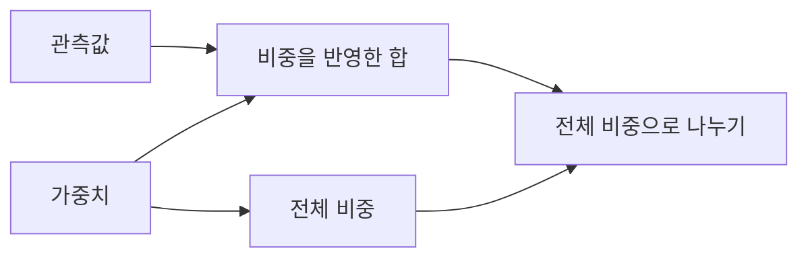

# 예시 학습 노트 — 가중평균

> [!note] 형식 예시
> 실제 학습 기록이나 완료 증거가 아닙니다. 목표와 상세 설명을 한 페이지에서 읽는 방식만 보여줍니다.

## 학습 목표

관측값의 비중이 다를 때 평균을 어떻게 정의하는지 설명하고, 가중평균을 직접 계산할 수 있다.

## 핵심 개념

- **관측값** $x_i$: 결합할 값. 모든 관측값은 같은 단위를 사용한다.
- **가중치** $w_i$: 각 값의 상대적인 비중. 여기서는 무차원이고 $w_i \geq 0$이다.
- **전체 비중** $W = \sum_{i=1}^{n} w_i$: 평균을 정의하려면 $W > 0$이어야 한다.

## 상세 설명

### 1. 같은 비중에서 출발하기

산술평균은 각 관측값에 같은 비중을 준다.

$$
\bar{x} = \frac{x_1 + x_2 + \cdots + x_n}{n}
$$

예를 들어 $2$와 $8$의 산술평균은 $(2+8)/2 = 5$이다.

### 2. 비중이 다른 경우

$2$를 세 번, $8$을 한 번 포함하는 목록을 생각하면 평균은 다음과 같다.

$$
\bar{x}_w = \frac{2+2+2+8}{4}
          = \frac{3\cdot 2+1\cdot 8}{3+1}
          = 3.5
$$

이 예시에서는 반복 횟수가 가중치 역할을 한다. 일반적인 비음수 가중치에 대해서는 다음 식으로 가중평균을 정의한다.

$$
\bar{x}_w = \frac{\sum_{i=1}^{n} w_i x_i}{\sum_{i=1}^{n} w_i}
$$

관측값에 비중을 반영한 합을 구하고, 전체 비중으로 나누는 구조다. 아래 화살표는 계산에 필요한 입력과 처리 순서를 뜻한다.

분자는 관측값과 같은 단위이고 분모는 무차원이므로, 결과 역시 관측값과 같은 단위를 갖는다.

### 3. 결과 해석과 적용 조건

가중치가 모두 같은 양수라면 공통 가중치가 약분되어 산술평균이 된다.
$2$의 비중이 $8$보다 크므로 위 결과 $3.5$는 $2$에 더 가깝다.

비음수 가중치와 양수인 전체 비중을 사용하면 가중평균은 관측값의 최솟값과 최댓값 사이에 있다. 관측값의 단위가 다르면 이 식으로 바로 결합하지 않는다. 어떤 가중치를 선택해야 하는지는 별도의 문제이며, 이 예시가 센서의 최적 가중치까지 결정해 주는 것은 아니다.

## 복습 포인트

- 분자가 표현하는 것은 무엇이며, 왜 전체 비중으로 나누는가?
- 가중치가 모두 같으면 어떤 식이 되는가?
- 이 정의에서 필요한 가중치 조건과 관측값의 단위 조건은 무엇인가?

> [!info]- 별도 기록의 역할
> 실제 세션에서는 이 영역에 복습·확인·적용·회고 파일의 링크를 둡니다. 학습자의 대화 전문은 기본 노트에 넣지 않고, 다음 수업에 필요한 근거와 미해결 사항만 별도 인계 기록에 정리합니다.
